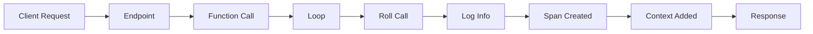
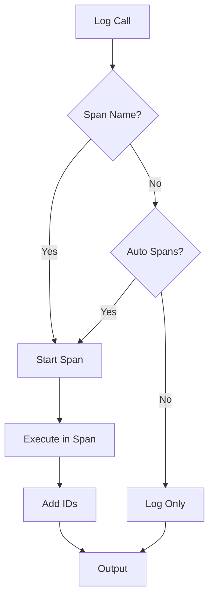

# A Sample FastAPI App with OpenTelemetry-Aware Logging

Welcome to the `roll-dice` sample FastAPI repository. This project demonstrates how to build a lightweight Python app that:

- uses a custom logging wrapper for normal `logger.info(...)` / `logger.error(...)`
- integrates OpenTelemetry trace context into log output
- can optionally create spans automatically from ordinary log calls
- keeps application code simple and familiar

---

## 🚀 What this repository shows

This repository is built to help developers understand and use a logger abstraction that:

- exposes a reusable `get_logger()` helper
- returns a logger that behaves like normal Python logging
- optionally starts a span using `span_name` and `span_attributes`
- automatically injects `trace_id` and `span_id` into logs when a span is active

---

## 📁 Key files

- `main.py` — FastAPI app with a `/rolldice` endpoint
- `otel_logger.py` — custom OpenTelemetry-aware logger adapter
- `pyproject.toml` — project dependencies
- `docker-compose.yaml` — Jaeger OTLP collector service for tracing

---

## 🧩 Use cases

### 1. Simple logging with no trace/span context

Use the logger exactly like a standard Python logger:

```python
logger.info("Some info log %s", result)
logger.error("Error during execution: %s", e)
```

This is ideal when you want consistent log formatting without explicitly creating spans.

### 2. Logging with a custom OpenTelemetry span attached

When you want a log event to also create a span, pass `span_name` and `span_attributes`:

```python
logger.info(
    "Rolled dice value %s",
    result,
    span_name="roll",
    span_attributes={"roll.value": result},
)
```

This creates a span named `roll`, records the attribute `roll.value`, and logs the message with trace/span IDs.

### 3. Exception logging with traceback support

Use `logger.exception(...)` to log errors and automatically capture traceback details:

```python
try:
    raise ValueError("Invalid roll")
except Exception as e:
    logger.exception("Error during execution: %s", e)
```

This behaves like regular Python logging and also adds trace context when a span is active.

### 4. Automatic span creation for every log call

If you want every log message to automatically start a span, create the logger with `auto_start_spans=True`:

```python
logger = get_logger("diceroller", auto_start_spans=True)
logger.info("Started processing")
logger.warning("Something may need attention")
```

Then each log call begins a span named after the log level, e.g. `info` or `warning`.

---

## 🧠 Workflow and call flow

### Application call flow



### Logging and tracing flow



---

## 🛠️ Steps to run the app

### 1. Install dependencies

```bash
uv sync
.venv/bin/python -m ensurepip --upgrade        # OTEL required `pip` to be installed
.venv/bin/python -m pip install --upgrade pip  # Upgrading the `pip` just in case
```

#### 1.2. Bootstrap OTEL for the app
```bash
.venv/bin/opentelemetry-bootstrap -a install
```

### 2. Start Jaeger for tracing

#### 2.1 Start the container for Jaeger
```bash
docker compose up -d
```

### 3. Run the FastAPI app with OTEL instrumantation enabled

```bash
.venv/bin/opentelemetry-instrument --service_name roll.dice5 .venv/bin/uvicorn main:app
```

### 4. Call the endpoint

```bash
curl http://127.0.0.1:8000/rolldice
```

### 5. View Jaeger

Open: `http://127.0.0.1:16686`

---

## 📌 Example `main.py` usage

```python
from fastapi import FastAPI
from random import randint
import copy

from otel_logger import get_logger  # 👈 NEEDED IMORT for OTEL logging

logger = get_logger("diceroller")   # 👈 Instantiating logger, also enabling OTEL instrumantation
app = FastAPI()

@app.get("/rolldice")
async def roll_dice():
    result = [roll() for _ in range(15)]
    return {"dice_rolls": result}


def roll():
    result = randint(1, 6)
    logger.info(
        "Rolled dice value %s",
        result,
        span_name="roll",
        span_attributes={"roll.value": result},
    )
    return result
```

---

## 🧪 What makes this repo special

- normal logging API: no complicated tracer code in your business logic
- first-class OpenTelemetry integration behind a small abstraction
- clean separation of logging setup and application behavior
- plug-and-play trace context in logs

---

## ✅ Summary

This repository is useful when you want:

- simple logs + OpenTelemetry context
- log-based span creation without explicit `with` blocks
- easy-to-understand code for FastAPI and OTEL
- good documentation for developers and operators

If you want, I can also add a dedicated example section for a fully managed tracing exporter and production-ready log formatting.
